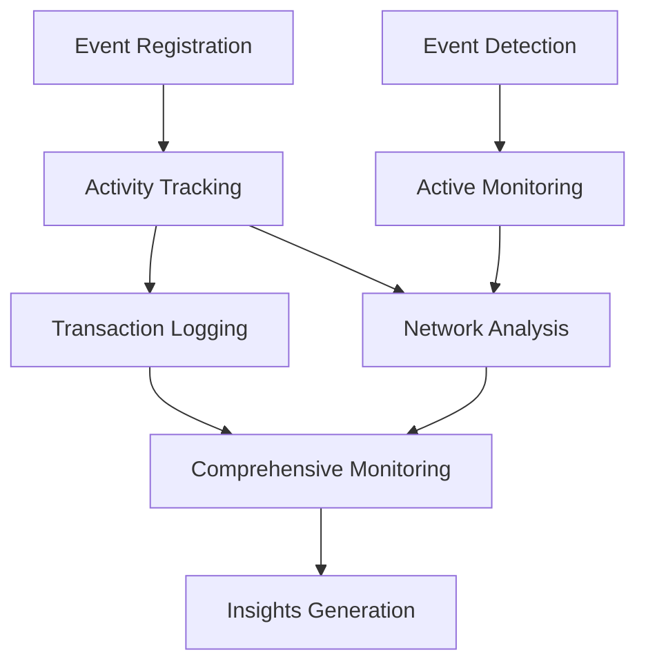

# Nakamoto Scanner

A blockchain activity tracking and monitoring system built on Stacks that provides comprehensive insights into network interactions, transaction patterns, and on-chain events.

## Overview

Nakamoto Scanner leverages blockchain technology to create a transparent, robust mechanism for tracking and analyzing network activities. The platform provides:

- Immutable transaction records
- Comprehensive event tracking
- Real-time network interaction monitoring
- Transparent blockchain activity scanning
- Advanced data analysis capabilities

## Architecture

The Nakamoto Scanner is built around a core smart contract that manages network event tracking, user interactions, and system-wide monitoring.



### Core Components

1. **Event Management**: Handles event registration and tracking
2. **Transaction Logging**: Records and validates network interactions
3. **Monitoring System**: Manages real-time network activity scanning
4. **Analysis Mechanism**: Generates insights from tracked data

## Contract Documentation

### nakamoto-tracker.clar

The main contract handling core functionality of the Nakamoto Scanner platform.

#### Key Features

- Network event registration
- Transaction type tracking
- Comprehensive monitoring mechanisms
- Activity pattern detection
- Transparent data logging

#### Access Control

- Network participants can register events
- Authorized users can initiate scans
- Contract owner manages system parameters

## Getting Started

### Prerequisites

- Clarinet
- Stacks blockchain node
- Web3 development environment

### Installation

1. Clone the repository
2. Install dependencies with Clarinet
3. Deploy contracts to the Stacks network

### Basic Usage

```clarity
;; Register a network event
(contract-call? .nakamoto-tracker register-event "tx-type" u100)

;; Log a transaction
(contract-call? .nakamoto-tracker log-transaction "transfer" u500 none)

;; Create a network scan
(contract-call? .nakamoto-tracker create-scan 
    "Block Range Scan" 
    "Comprehensive transaction analysis" 
    u1000 u2000)

;; Initiate event tracking
(contract-call? .nakamoto-tracker track-event u1)
```

## Function Reference

### Public Functions

#### `register-event`
```clarity
(define-public (register-event (event-type (string-utf8 50))))
```
Registers a new network event type.

#### `log-transaction`
```clarity
(define-public (log-transaction 
    (tx-type (string-utf8 20)) 
    (tx-volume uint) 
    (notes (optional (string-utf8 200)))))
```
Records a new blockchain transaction.

#### `create-scan`
```clarity
(define-public (create-scan 
    (name (string-utf8 100)) 
    (description (string-utf8 500))
    (start-block uint)
    (end-block uint)))
```
Creates a new network scanning task.

#### `track-event`
```clarity
(define-public (track-event (event-id uint)))
```
Initiates tracking for a specific event.

### Read-Only Functions

#### `get-event-details`
```clarity
(define-read-only (get-event-details (event-id uint)))
```
Retrieves event tracking information.

#### `get-transaction`
```clarity
(define-read-only (get-transaction (tx-id uint)))
```
Retrieves details of a specific transaction.

#### `get-scan-status`
```clarity
(define-read-only (get-scan-status (scan-id uint)))
```
Retrieves status of a network scan.

## Development

### Testing

Run tests using Clarinet:

```bash
clarinet test
```

### Local Development

1. Start a local Clarinet console:
```bash
clarinet console
```

2. Deploy contracts:
```bash
clarinet deploy
```

## Security Considerations

### Limitations

- Event tracking limited to predefined types
- Scan ranges have block height constraints
- Transaction volume tracking has upper limits

### Best Practices

1. Validate event parameters before registration
2. Ensure transaction data accuracy
3. Monitor scan completion status
4. Verify transaction success for all operations

### Data Validation

- Event types must be pre-approved
- Transaction volumes must be positive
- Scan block ranges must be logical
- Event names have length restrictions